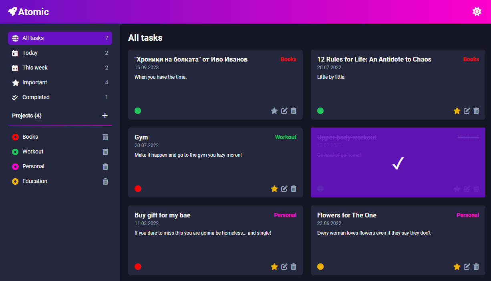

## Project: [Atomic](https://atomic-gdimitroff.netlify.app/)

A dynamically created To-do list with **vanilla JavaScript**. The data is stored in **localStorage**. The project is from The Odin Project [curriculum](https://www.theodinproject.com/lessons/node-path-javascript-todo-list).

### Getting Started

In order to setup and work on this project on your own, you will need to:

1. Clone this project:  
   `git clone https://github.com/GDimitroff/atomic.git`

2. Once you have cloned this project, you can install the required dependencies by using:  
   `npm install`

3. A live demo of the project can be started by using:  
   `npm start`

4. Distribution files can be produced using:  
   `npm run build`

### Features

- You can **add**, **delete** and **edit** projects and tasks.
- You can choose from **eight colors** when adding a project.
- You can write task **description**, **date** and **priority**.
- You can choose which tasks belongs to what project. You can edit it dynamically.
- You can see **from which project** is the task, depending on the color and title of the project.
- You can see what tasks must be **done for today** or **within a week**.
- You can see what tasks are **important** and already **completed**.
- Fancy **notifications** are available.
- Yon can switch between **light** and **dark** theme.

### Outcome

- Used **HTML5 semantic elements** for better structure and readability.
- Used **CSS Grid** and **CSS Flexbox** modules to create layout.
- Deepened knowledge of **DOM manipulation**.
- Improved understanding of **npm**, **git** and **webpack**.
- Learned to organize everything into **modules** and **components**.
- Used **revealing module** and **factory patterns** for code organizing.
- Tried to create a **stylish** and **atomic** look.
- Cross tested on **Firefox** and **Chromium** browsers.
- Made functionality of **saving data** to `localStorage`.
- Made project to be **fully mobile responsive**.
- Overall, I have **improved my learning abilities** A LOT! 🧠

